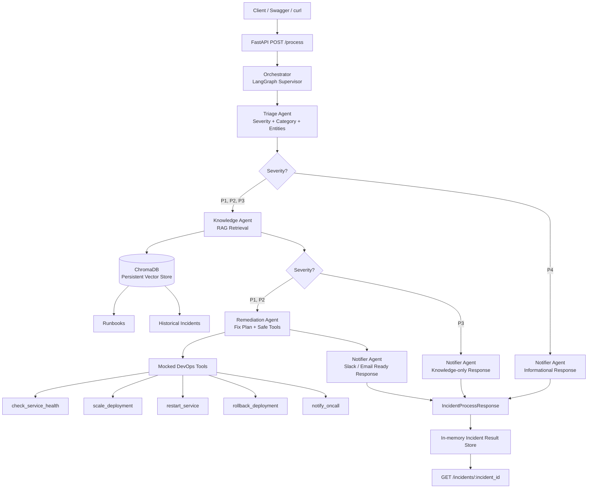

# IncidentIQ

AI-powered DevOps incident triage and resolution.

---

## Overview

IncidentIQ is a multi-agent DevOps/SRE assistant that accepts an incident payload, classifies severity, retrieves related runbooks and historical incidents using RAG, proposes remediation steps, invokes safe mocked DevOps tools, and returns a Slack/email-ready incident response.

The project demonstrates:

* FastAPI REST APIs
* LangGraph multi-agent orchestration
* Conditional routing based on incident severity
* Pydantic A2A contracts between agents
* ChromaDB persistent vector store
* RAG over runbooks and historical incidents
* Mocked DevOps tools
* Structured JSON logs
* Trace ID per request
* Metrics endpoints
* Docker and Docker Compose
* GitHub Actions CI

---

## Problem Statement

DevOps and SRE teams often spend significant time triaging incidents manually by checking alerts, dashboards, logs, runbooks, previous incidents, and deployment history.

IncidentIQ reduces this effort by automating the first-level incident triage and response workflow.

The system can:

1. Classify incident severity as P1, P2, P3, or P4.
2. Classify the incident category.
3. Extract important entities.
4. Retrieve related runbooks and historical incidents.
5. Propose remediation steps.
6. Invoke safe mocked DevOps tools.
7. Format the final response for Slack, email, or incident channels.

---

## Tech Stack

| Area                | Technology                             |
| ------------------- | -------------------------------------- |
| Language            | Python 3.11+                           |
| API Framework       | FastAPI                                |
| ASGI Server         | Uvicorn                                |
| Agent Orchestration | LangGraph                              |
| LLM/RAG Framework   | LangChain                              |
| Vector Database     | ChromaDB embedded persistent           |
| Embeddings          | sentence-transformers/all-MiniLM-L6-v2 |
| Validation          | Pydantic v2                            |
| Containerization    | Docker, Docker Compose                 |
| CI/CD               | GitHub Actions                         |
| Observability       | JSON logs, trace IDs, metrics          |

---

## Agent Architecture

| Agent             | Responsibility                                                |
| ----------------- | ------------------------------------------------------------- |
| Orchestrator      | LangGraph supervisor that routes between agents               |
| Triage Agent      | Classifies severity, category, and extracts entities          |
| Knowledge Agent   | Retrieves similar incidents and runbooks using RAG            |
| Remediation Agent | Proposes remediation steps and invokes mocked tools when safe |
| Notifier Agent    | Formats the final Slack/email-ready response                  |

---

## Architecture Diagram




---

## LangGraph Workflow

IncidentIQ uses conditional routing based on severity.

### P1 / P2 Workflow

```text
Triage Agent
    ↓
Knowledge Agent
    ↓
Remediation Agent
    ↓
Notifier Agent
```

Example workflow path:

```json
[
  "Triage Agent",
  "Knowledge Agent",
  "Remediation Agent",
  "Notifier Agent"
]
```

### P3 Workflow

```text
Triage Agent
    ↓
Knowledge Agent
    ↓
Notifier Agent
```

Example workflow path:

```json
[
  "Triage Agent",
  "Knowledge Agent",
  "Notifier Agent"
]
```

### P4 Workflow

```text
Triage Agent
    ↓
Notifier Agent
```

Example workflow path:

```json
[
  "Triage Agent",
  "Notifier Agent"
]
```

P4 informational alerts skip Knowledge and Remediation to avoid unnecessary automation.

---

## Project Structure

```text
incidentiq/
  app/
    api/
      routes/
        health.py
        incidents.py
        metrics.py
        process.py
    agents/
      triage_agent.py
      knowledge_agent.py
      remediation_agent.py
      notifier_agent.py
      orchestrator.py
    core/
      config.py
      logging_config.py
      logging_middleware.py
      trace.py
    graph/
      state.py
      workflow.py
    rag/
      chunker.py
      ingest.py
      retriever.py
      vector_store.py
    schemas/
      agent_messages.py
      incident.py
      metrics.py
      responses.py
    services/
      incident_service.py
      metrics_service.py
    tools/
      devops_tools.py
    main.py

  data/
    incidents/
    runbooks/

  k8s/

  scripts/
    start.sh

  tests/

  .github/
    workflows/
      ci.yml

  Dockerfile
  docker-compose.yml
  .dockerignore
  .env.example
  .env.docker
  generate_data.py
  requirements.txt
  README.md
```

---

## Environment Configuration
Local demo configuration:

```env
APP_NAME=IncidentIQ
APP_VERSION=1.0.0
APP_ENV=local
DEBUG=true

API_HOST=0.0.0.0
API_PORT=8000

LLM_PROVIDER=mock
MOCK_LLM=true

OLLAMA_BASE_URL=http://localhost:11434
OLLAMA_MODEL=llama3.1:8b

CHROMA_PERSIST_DIR=storage/chroma
CHROMA_COLLECTION_NAME=incidentiq_knowledge_base
EMBEDDING_MODEL_NAME=sentence-transformers/all-MiniLM-L6-v2

CHUNK_SIZE=800
CHUNK_OVERLAP=120
RETRIEVAL_TOP_K=4

INCIDENT_DATA_PATH=data/incidents/incidents.json
RUNBOOK_DATA_DIR=data/runbooks

ENABLE_JSON_LOGS=true
LOG_LEVEL=INFO
ENABLE_METRICS=true
```

For stable demos, keep:

```env
LLM_PROVIDER=mock
MOCK_LLM=true
```

---

## Local Setup

### 1. Create virtual environment


```powershell
python -m venv .venv
.\.venv\Scripts\Activate.ps1
```

### 2. Install dependencies

```bash
pip install -r requirements.txt
```

### 3. Generate synthetic data

```bash
python generate_data.py
```

This creates:

```text
data/incidents/incidents.json
data/runbooks/*.md
```

### 4. Ingest RAG corpus into ChromaDB

```bash
python -m app.rag.ingest
```

This creates the persistent ChromaDB vector store under:

```text
storage/chroma
```

### 5. Start FastAPI

```bash
uvicorn app.main:app --reload
```

Open Swagger UI:

```text
http://127.0.0.1:8000/docs
```

---

## Docker Setup

### 1. Build Docker image

```bash
docker compose build
```

### 2. Run application

```bash
docker compose up
```

Open Swagger UI:

```text
http://127.0.0.1:8000/docs
```

### 3. Run in detached mode

```bash
docker compose up -d
```

### 4. View logs

```bash
docker compose logs -f incidentiq-api
```

### 5. Stop containers

```bash
docker compose down
```

### 6. Stop containers and remove volumes

```bash
docker compose down -v
```

Use `-v` only when you want to delete generated data and ChromaDB storage.

---


## API Endpoints

| Method | Endpoint                   | Description                                    |
| ------ | -------------------------- | ---------------------------------------------- |
| GET    | `/health`                  | Health check                                   |
| POST   | `/process`                 | Process an incident through LangGraph workflow |
| GET    | `/incidents/{incident_id}` | Retrieve a previously processed incident       |
| GET    | `/metrics`                 | JSON metrics                                   |
| GET    | `/metrics/prometheus`      | Prometheus-style metrics                       |

---

## curl Commands

### Health Check

```bash
curl -X GET "http://127.0.0.1:8000/health"
```

Expected response:

```json
{
  "status": "healthy",
  "app_name": "IncidentIQ",
  "version": "1.0.0"
}
```

---

### P1 Database Incident

This demonstrates the full workflow:

```text
Triage Agent → Knowledge Agent → Remediation Agent → Notifier Agent
```

```bash
curl -X POST "http://127.0.0.1:8000/process" \
  -H "Content-Type: application/json" \
  -H "X-Trace-Id: demo-trace-p1-001" \
  -d '{
    "incident_id": "INC-DEMO-1001",
    "title": "Database connection pool exhausted",
    "description": "Checkout service is failing with SQLTimeoutException. DB connection pool usage is 98 percent and latency is 2400 ms.",
    "service": "checkout-service",
    "environment": "production",
    "metrics": {
      "db_pool_usage": 98,
      "error_rate": 12.5,
      "latency_ms": 2400
    }
  }'
```

Expected important fields:

```json
{
  "incident_id": "INC-DEMO-1001",
  "triage_result": {
    "severity": "P1",
    "category": "database"
  },
  "workflow_path": [
    "Triage Agent",
    "Knowledge Agent",
    "Remediation Agent",
    "Notifier Agent"
  ]
}
```

---

### P4 Informational Alert

This demonstrates conditional routing where remediation is skipped:

```text
Triage Agent → Notifier Agent
```

```bash
curl -X POST "http://127.0.0.1:8000/process" \
  -H "Content-Type: application/json" \
  -H "X-Trace-Id: demo-trace-p4-001" \
  -d '{
    "incident_id": "INC-DEMO-1002",
    "title": "Minor CPU increase in reporting service",
    "description": "Reporting service CPU increased for 10 minutes. No customer impact was observed and latency stayed within SLO.",
    "service": "reporting-service",
    "environment": "production",
    "metrics": {
      "cpu_usage": 72
    }
  }'
```

Expected important fields:

```json
{
  "incident_id": "INC-DEMO-1002",
  "triage_result": {
    "severity": "P4"
  },
  "knowledge_result": null,
  "remediation_plan": null,
  "workflow_path": [
    "Triage Agent",
    "Notifier Agent"
  ]
}
```

---

### Retrieve Processed Incident

```bash
curl -X GET "http://127.0.0.1:8000/incidents/INC-DEMO-1001"
```

Expected important fields:

```json
{
  "incident_id": "INC-DEMO-1001",
  "response": {
    "incident_id": "INC-DEMO-1001",
    "workflow_path": [
      "Triage Agent",
      "Knowledge Agent",
      "Remediation Agent",
      "Notifier Agent"
    ]
  }
}
```

---

### JSON Metrics

```bash
curl -X GET "http://127.0.0.1:8000/metrics"
```

Expected important fields:

```json
{
  "app_name": "IncidentIQ",
  "workflow_metrics": {
    "total_incidents_processed": 1,
    "incidents_by_severity": {
      "P1": 1
    }
  }
}
```

---

### Prometheus-style Metrics

```bash
curl -X GET "http://127.0.0.1:8000/metrics/prometheus"
```

Expected sample:

```text
incidentiq_uptime_seconds 120.5
incidentiq_http_requests_total 5
incidentiq_incidents_processed_total 1
incidentiq_mocked_tool_executions_total 4
```

---


## Mocked DevOps Tools

The Remediation Agent can invoke mocked tools when actions are safe.

| Tool                   | Purpose                                                           |
| ---------------------- | ----------------------------------------------------------------- |
| `check_service_health` | Checks mocked service health                                      |
| `scale_deployment`     | Simulates scaling a service                                       |
| `restart_service`      | Simulates a rolling restart                                       |
| `rollback_deployment`  | Simulates rollback but is skipped when human approval is required |
| `notify_oncall`        | Simulates PagerDuty/Slack notification                            |

No real infrastructure commands are executed.

---

## RAG Corpus

IncidentIQ uses synthetic data generated by `generate_data.py`.

The generated corpus includes:

* 25 historical incidents
* Runbooks for common DevOps issues

Covered scenarios include:

* Database connection pool exhaustion
* OOMKilled pods
* Disk full
* Redis high CPU
* DNS failures
* Certificate expiry
* Slow queries
* Rate limits
* Deployment rollbacks
* Network partitions

RAG pipeline:

```text
Synthetic incidents + runbooks
    ↓
Chunking
    ↓
sentence-transformers/all-MiniLM-L6-v2 embeddings
    ↓
ChromaDB persistent vector store
    ↓
Knowledge Agent retrieval
    ↓
Grounded remediation and notification
```

---

## CI/CD

GitHub Actions workflow:

```text
.github/workflows/ci.yml
```

The CI workflow performs:

* Dependency installation
* Python syntax check
* Ruff critical checks
* Synthetic data generation check
* FastAPI import check
* `/health` smoke test
* `/metrics` smoke test
* Docker image build check

---
